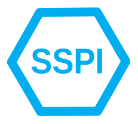

<div align="center">
    
  <h1>Node expose sspi</h1>
  <p>
    Expose the Microsoft Windows SSPI (SSP Interface) to <a href="https://nodejs.org/">Node.js®</a>.
  </p>
</div>

Use cases:

- **NTLM** and **Kerberos** SSO authentication, both server and client inside a private windows organization network, for instance an ERP in a private company.
- **Active Directory** access to users for detailed info.

Requirements: Microsoft Windows OS, NodeJS version >=12.16.1. Architecture: x64 or ia32.

## Reference

 - [Complete reference guide](./doc/reference/index.md)
 - [Authentication error analysis](./doc/error/index.md)

## Install

[](./LICENSE)
[](https://badge.fury.io/js/node-expose-sspi)
[](https://github.com/sponsors/jlguenego)

Just do:

```
npm i node-expose-sspi
```

Note: There is a prebuilt binary node addon that will be installed.

## Usage

### SSO Authentication server use case

```bat
mkdir myproject
cd myproject
npm init -y
npm i express
npm i node-expose-sspi
```

Make an express web server by doing the `server.js` file:

```js
const express = require('express');
const { sso } = require('node-expose-sspi');

const app = express();
app.use(sso.auth());

app.use((req, res, next) => {
  res.json({
    sso: req.sso,
  });
});

app.listen(3000, () => console.log('Server started on port 3000'));
```

```
node server.js
```

**Browser on http://localhost:3000**

```
{
  "sso": {
    "method": "NTLM",
    "user": {
      "domain": "JLG",
      "name": "jlouis",
      "displayName": "Jean-Louis P. GUÉNÉGO",
      "groups": [
        "JLG\\Domain Users",
        "\\Everyone",
        // ...
      ],
      "sid": "S-1-5-21-2022955591-1730574677-3210790899-1103",
      "adUser": {
        // adUser filled only if Active Directory is reachable.
        // ...
        "givenName": ["Jean-Louis"],
        "sn": ["GUÉNÉGO"],
        "c": ["FR"],
        "l": ["TORCY"],
        "postalCode": ["77200"],
        "title": ["IT Consultant"],
        "description": ["My microsoft domain account for demonstrating SSO"]
      }
    }
  }
}
```

Note: To read JSON file on Chrome, you should use the [JSON Formatter Chrome Extension](https://chrome.google.com/webstore/detail/json-formatter/bcjindcccaagfpapjjmafapmmgkkhgoa).

**Command line client:**

- Git Bash: `curl --negotiate -u : http://localhost:3000 -b cookie.txt`
- Powershell: `Invoke-WebRequest -uri http://localhost:3000 -UseDefaultCredentials`

To know more, you can follow the [SSO Reference Manual](./doc/reference/index.md).

### SSO Authentication client use case

**[See the complete example](./doc/use-case/client.md)**

### Account context status

```js
const { sso } = require('node-expose-sspi');
```

The `sso` object has following functions to help you:
- `sso.hasAdminPrivileges()`: check if user has administrator privileges. A user can be administrator, but when starting a process, it does not have administrator privileges by default. To have them, the process needs to be *started as an administrator*. [See Microsoft documentation about it](https://docs.microsoft.com/en-us/windows/security/identity-protection/user-account-control/how-user-account-control-works).
- `sso.isOnDomain()`: check if the computer has joined a domain.
- `sso.isActiveDirectoryReachable()`: check if the Active Directory domain controller is reachable.

## API

**[Fully detailed API document](./doc/api/README.md)**.

## Browsers

### Chrome

No conf. It just works.

### Firefox

Unlike Chrome, NTLM and Kerberos are not activated by default in Firefox. To make it working, you need to follow these steps:

1. Navigate to the URL `about:config`.
2. Click past the warning of harmful consequences.
3. Type `negotiate-auth` into the filter at the top of the page, in order to remove most of the irrelevant settings from the list.
4. Double-click on `network.negotiate-auth.trusted-uris`. A dialogue box for editing the value should appear.
5. Enter the required hostname(s) and/or URL prefix(es) then click OK. For the above example, it is `http://localhost:3000`

[More detailed info here](http://www.microhowto.info/howto/configure_firefox_to_authenticate_using_spnego_and_kerberos.html).

### Edge

Edge does not require any configuration. But the browser ask the credentials to the user each time it is started.

### IE11

IE11 does not require any configuration. Be careful it does not open JSON files in a simple way.

## Typescript

This module is ready to be used with both typescript and javascript. No need extra typings.

[Typescript example](./doc/typescript.md)

## Authentication protocols

### Kerberos

Kerberos is recommanded for production running. For running with Kerberos protocol, both client and server needs to be joined on a [Windows Domain](https://en.wikipedia.org/wiki/Windows_domain).

3 conditions must be met for running Kerberos:

- The node server, running `node-expose-sspi` needs to be run as a domain user with service principal name (SPN) declared in Active Directory.
- The client browser needs to be run on a windows domain account.
- The website url needs to be declared in a white list of intranet website.

[You can find more detail in the Kerberos dedicated documentation](./doc/Kerberos.md).

### NTLM

If you are not on a Windows Domain, `node-expose-sspi` will use the NLTM authentication protocol.

If both the server and the client are on a Windows Domain, NTLM will be used if the Kerberos conditions are not met. [See the Kerberos chapter of this README](#Kerberos).

The NTLM protocol is less secure than Kerberos and not secure at all if you are not under an HTTPS connection. This is because both login and password hash go on the HTTP request, just encoded in base64...

Another thing bad in NTLM is that browsers sometimes popup a dialog box to ask credentials to the user. Your users don't like that. This is a bad user experience.

## Authentication error analysis

If you encounter error, [please read this document before submitting an issue](./doc/use-case/errors.md).

## Production running

### Performance

You should avoid to use the Negotiate protocol each time a user access an authenticated resources, because it may take times.

Just use the Negotiate protocol once with `sso.auth()` on a specific connection url, and then put a session id cookie associated with the `req.sso` object. [Please see this example.](./examples/express-ejs])

### Server behind a reverse proxy

[Example: node server behind an IIS proxy](./doc/use-case/production-windows.md)

## Examples

To run the examples, just clone this project.

```
git clone https://github.com/jlguenego/node-expose-sspi.git
npm i
cd node-expose-sspi
cd examples
cd <***example-name***>
```

Look also at the `README.md` of the example.

Examples :

- [Express simple](./examples/express-simple/)
- [Express with EJS](./examples/express-ejs/)
- [Koa simple](./examples/koa-simple/)
- [Fastify simple](./examples/fastify-simple/)
- [Restify simple](./examples/restify-simple/)
- [Reverse proxy example](./examples/reverse-proxy/)
- [Angular SSO example](https://github.com/jlguenego/angular-sso-example)
- [React SSO example](https://github.com/jlguenego/react-sso-example)
- [Vue SSO example](https://github.com/jlguenego/vue-sso-example)
- [HTTP(S) fetch API with SSO](./doc/use-case/client.md)

## Development

As a prerequisites, you need node-gyp and a C++ toolchain installed on your environment.

If you did not installed node-gyp and the C++ toolchain,
please open a **PowerShell command line as an administrator** and do :

```
npm i -g windows-build-tools
```

To compile the native node module, do the following:

```
git clone https://github.com/jlguenego/node-expose-sspi.git
cd node-expose-sspi
npm run build
npm run test
```

There are 2 dev areas :

- **C++ code**: run `npm run dev` to watch the modifications and recompile ASAP.
- **Typescript code**: run `npm run build:tsw` to recompile while watching.

All tests are done with [mocha](https://github.com/mochajs/mocha).

The module [debug](https://github.com/visionmedia/debug) is used for printing some debug info.

## Hardware architecture

To both compile ia32 and x64, run the `npm run build:arch` command.

## TODO

Any idea of new features ? Please tell me and raise an issue. :blush:

- write a loopback example
- write a nestjs example
- write a medium article
- Integrate with passport?
- Test with 10000 users.
- UTF8 everywhere

Scenario:

- linux trial.

## Thanks

Thanks to all the people who wrotes the npm modules required by this project.

And a very special thanks to the authors of the [node-sspi](https://github.com/abbr/NodeSSPI) project that helped me writing this one. I considere node-sspi to be the father of node-expose-sspi.

Thanks also to people raising issues to improve the quality of this module.

## Sponsoring

This library design aims to be used in production, in private company environment, doing business, using Microsoft Windows.

[To help maintaining it, you can sponsor me with github](https://github.com/sponsors/jlguenego).

## Author

Jean-Louis GUENEGO <jlguenego@gmail.com> (http://jlg-consulting.com/)

You may participate to complete this project. You can improve this doc, or check the code (memory leak, etc.), create new usefull business cases, etc.

Contributors are welcome!
